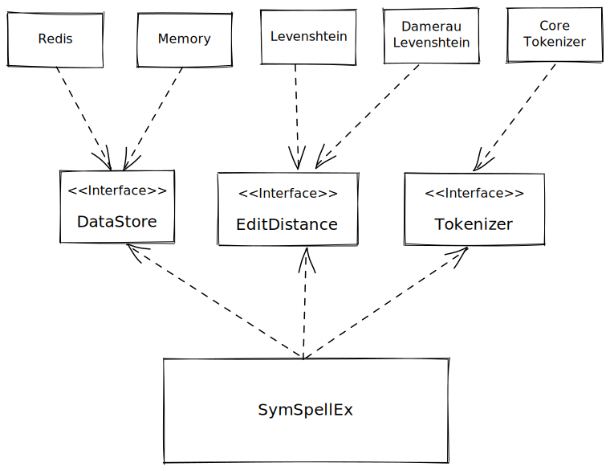

# **SymSpellEx**

Spelling correction & Fuzzy search based on *Symmetric Delete Spelling Correction algorithm* (SymSpell)

> Work in progress, need more optimizations

[](https://nodejs.org)
[](https://www.npmjs.com/package/symspell-ex)
[](https://github.com/m-elbably/symspell-ex/workflows/symspell-ex/badge.svg)
[](https://coveralls.io/github/m-elbably/symspell-ex?branch=main)
[](https://raw.githubusercontent.com/m-elbably/symspell-ex/master/LICENSE)

## Installation
    npm install symspell-ex --save

> Changes v1.1.1
> - Tokenization support
> - Term frequency should be provided for training and terms should be unique
> - Correct function return different object (`Correction` object) 
> - Hash table implemented in redis store instead of normal list structure
> - Enhanced testing code and coverage
> - Fixed bugs in lookup

## Features
- ***Very fast***
- ***Word suggestions***
- ***Word correction***
- ***Multiple languages supported*** - _The algorithm, and the implementation are language independent_ 
- ***Extendable*** - _Edit distance and data stores can be implemented to extend library functionalities_

## Usage

### Training

For single term training you can use `add` function:
```typescript
import {SymSpellEx, MemoryStore} from 'symspell-ex';

const LANGUAGE = 'en';
// Create SymSpellEx instnce and inject store new store instance
symSpellEx = new SymSpellEx(new MemoryStore());
await symSpellEx.initialize();
// Train data
await symSpellEx.add("argument", LANGUAGE);
await symSpellEx.add("computer", LANGUAGE);
```

For multiple terms (Array) you can use `train` function:
```typescript
const terms = ['argument', 'computer'];
await symSpellEx.train(terms, 1, LANGUAGE);
```

### Searching
`search` function can be used to get multiple suggestions if available up to the `maxSuggestions` value

Arguments:
- `input` _String_ (Wrong/Invalid word we need to correct)
- `language` _String_ (Language to be used in search)  
- `maxDistance` _Number_, _optional_, default = `2` (Maximum distance for suggestions)
- `maxSuggestions` _Number_, _optional_, default = `5` (Maximum suggestions number to return)

Return: `Array<Suggetion>` Array of suggestions

Example
```typescript
await symSpellEx.search('argoments', 'en');
```
Example `Suggestion Object`:
```json
{
  "term": "argoments",
  "suggestion": "arguments",  
  "distance": 2,
  "frequency": 155
}
```

### Correction
`correct` function can be used to get the best suggestion for input word or sentence in terms of edit distance and frequency

Arguments:
- `input` _String_ (Wrong/Invalid word we need to correct)
- `language` _String_ (Language to be used in search)
- `maxDistance` _Number_, _optional_, default = `2` (Maximum distance for suggestions)

Return: `Correction` object which contains original `input` and corrected `output` string, with array of suggestions  

Example
```typescript
await symSpellEx.correct('Special relatvity was orignally proposed by Albert Einstein', 'en');
```

Returns this `Correction` object:
> This output is totally depending on the quality of the training data that was push into the store
```json
{
  "suggestions": [],
  "input": "Special relatvity was orignally proposed by Albert Einstein",
  "output": "Special relativity was originally proposed by albert Einstein"
}
```

## Computational Complexity
The algorithm has constant time O(1) time, independent of the dictionary size, but depend on the average term length and maximum edit distance,
_Hash Table_ is used to store all search entries which has an average search time complexity of O(1).

## Why the algorithm is fast?

### Pre-calculation
in training phase all possible spelling error variants as generated (deletes only) and stored in hash table

> This makes the algorithm very fast, but it also required a large memory footprint, and the training phase takes a considerable amount of time to build the dictionary first time.
> _(Using RedisStore makes it easy to train and build once, then search and correct from any external source)_
 
### Symmetric Delete Spelling Correction
It allows a tremendous reduction of the number of spelling error candidates to be pre-calculated (generated and added to hash table), 
which then allows O(1) search while getting spelling suggestions.

## Library Design


### Tokenizer
This interface can be implemented to provide a different tokenizer for the library

Interface type
```typescript
export interface Tokenizer {
    tokenize(input: string): Array<Token>;
}
```

### EditDistance
This interface can be implemented to provide more algorithms to use to calculate edit distance between two words
> **[Edit Distance](https://en.wikipedia.org/wiki/Edit_distance)** 
> is a way of quantifying how dissimilar two strings (e.g., words) are to one another by counting the minimum number of operations required to transform one string into the other

Interface type
```typescript
interface EditDistance {
    name: String;
    calculateDistance(source: string, target: string): number;
}
```

### DataStore
This interface can be implemented to provide additional method to store data other than built-in stores (Memory, Redis)

Data store should handle storage for these 2 data types:
- **Terms**: List data structure to store terms and retrieve it by index
- **Entries**: Hash Table data structure to store dictionary entries and retrieve data by term (_Key_)

> Data store should also handle storage for multiple languages and switch between them

Interface type
```typescript
export interface DataStore {
    name: string;
    initialize(): Promise<void>;
    isInitialized(): boolean;
    setLanguage(language: string): Promise<void>;
    pushTerm(value: string): Promise<number>;
    getTermAt(index: number): Promise<string>;
    getTermsAt(indexes: Array<number>): Promise<Array<string>>;
    getEntry(key: string): Promise<Array<number>>;
    getEntries(keys: Array<string>): Promise<Array<Array<number>>>;
    setEntry(key: string, value: Array<number>): Promise<boolean>;
    hasEntry(key: string): Promise<boolean>;
    maxEntryLength(): Promise<number>;
    clear(): Promise<void>;
}
```

#### Built-in data stores
- Memory: Stores data in memory, using array structure for terms and high speed hash table [(megahash)](https://www.npmjs.com/package/megahash)
to manage dictionary entries
> May be limited by node process memory limits, which can be overridden

- Redis: Stores data into Redis database using list structure to store terms and hash to store dictionary data
> Very efficient way to train and store data, it will allow accessing by multiple processes and/or machines, 
> also dumping and migrating data will be easy

TODO

- [x] Tokenization
- [x] Sentence correction
- [x] Bulk data training  
- [ ] Word Segmentation
- [ ] Domain specific correction

#### References
* [Symmetric Delete Spelling Correction](https://wolfgarbe.medium.com/1000x-faster-spelling-correction-algorithm-2012-8701fcd87a5f)
* [SymSpell](https://github.com/wolfgarbe/SymSpell)

#### License
MIT

